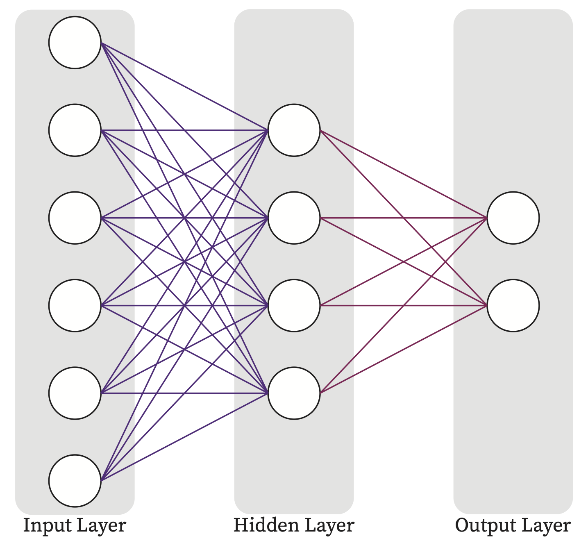
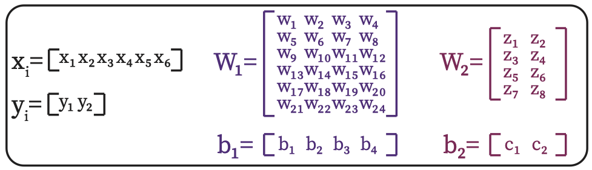

In this example, we take a simple MLP network and illustrates the insight of different distributed training approaches.

Following is the mlp network diagram and its corrsponding parameters (weight and bias matrices).

| 2-layer MLP | Corresponding Matrices |
|:-----:|:-----:|
| |  |